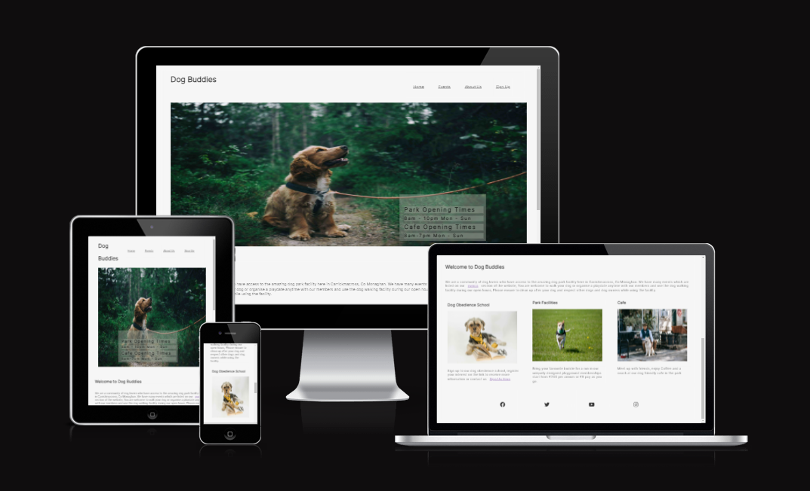
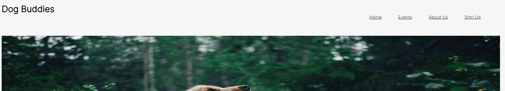
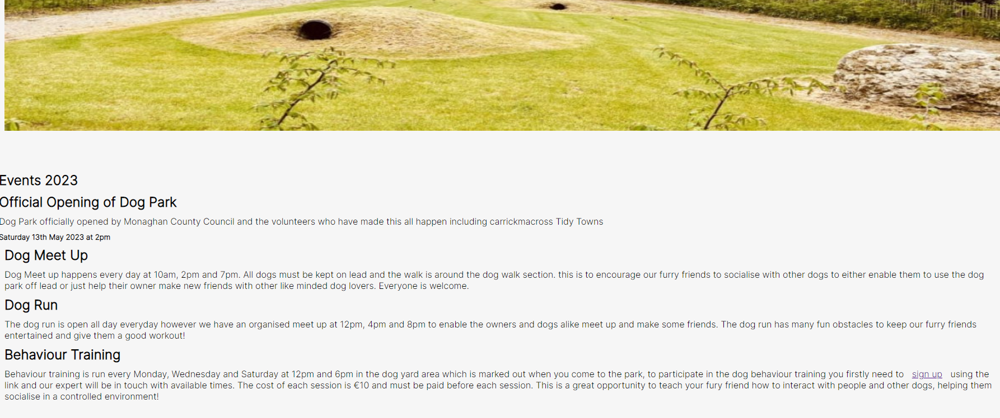
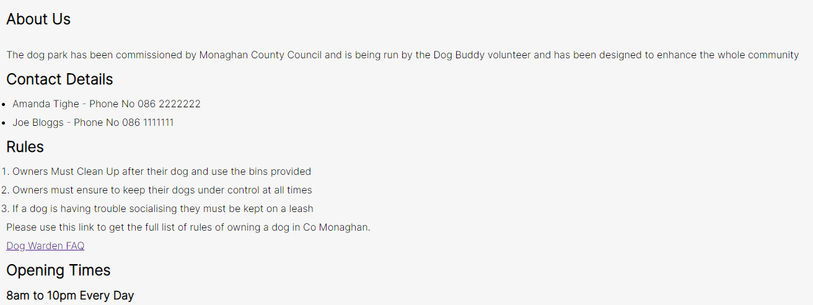
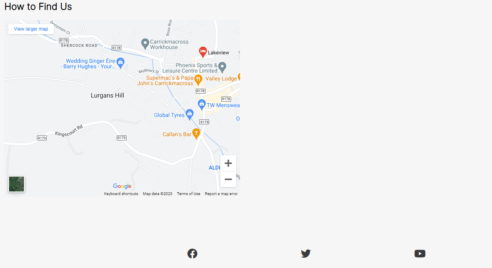
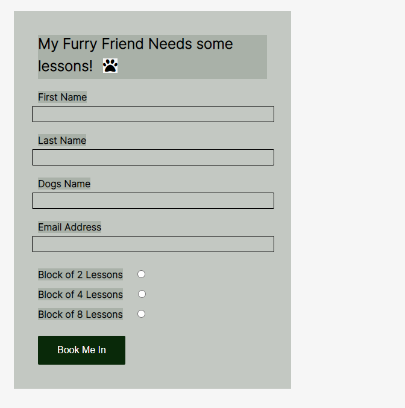

# Dog Buddies

Welcome to the dog buddies website, I decided to create this dog buddies website to give awareness of the new dog park opening in the local area and allow people the opportunity to meet up.
This site is targeted towards people who enjoy dogs and want to meet new like minded people. This website will give the user information regarding opening times, costs and events planned as well as the location and contact details if they need to get in touch. There is a section on the site to sign up to the classes being run.

# Existing Features

- _Navigation Bar_
  
- The Navigation bar consists of links to the pages on the website inlcuding Home, Events, About Us and Sign Up.
- The navigation bar is available on all pages of the website and are fully responsive

- _Landing Page Image_
  
- This shows a dog in nature as the dog walk is intended
- It has a transparent square telling opening times of the dog park and cafe.

- _Events Page_
  
- This page has a landing picture to show the dog park and the play areas in it
- The events are listed with cost and times

- _About Us_
  
- Showing contact information
- Rules of the park
- Sponsors of the park

- Google Maps to show location of the park

-_Sign Up_

-This form allows the user to sign up for dog obedience training indicating how many sessions they require.

# Features Left to Implement

Hightlight the cafe more, with menu and preordering

## Testing

Open Home Link on each page         PASS
Open Events Link on each Page       PASS
Open About Us Link on each page     PASS
Open Sign Up Link on each Page      PASS
Check tablet size response          PASS
Check phone size response           PASS

### Validator Testing

- HTML
  - No errors were returned when passing through the official [W3C validator](https://validator.w3.org/nu/?doc=https%3A%2F%2Famandatig.github.io%2FPortfolio1%2F)
- CSS
  - No errors were found when passing through the official [(Jigsaw) validator](https://jigsaw.w3.org/css-validator/validator?uri=https%3A%2F%2Fvalidator.w3.org%2Fnu%2F%3Fdoc%3Dhttps%253A%252F%252Fcode-institute-org.github.io%252Flove-running-2.0%252Findex.html&profile=css3svg&usermedium=all&warning=1&vextwarning=&lang=en#css)
